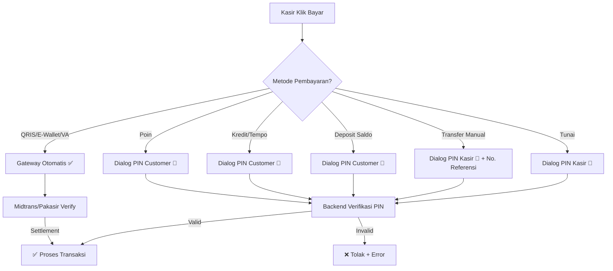

# 🐛 Analisis Bug & Plan Perbaikan — POS Skillage Mart

> **Tanggal**: 25 Agustus 2026
> **Sumber Bug**: Chat Pak Hakim + 7 screenshot dari `C:\Pak-Hakim\Worker\Bug POS`
> **Codebase**: `C:\Pak-Hakim\Project\s-mart` (Laravel 11 + React/Inertia.js)

---

## 📊 Ringkasan Bug (8 Issue)

| # | Bug / Requirement | Severity | Status | File Utama |
|---|-------------------|----------|--------|------------|
| 1 | Transfer Manual — langsung berhasil tanpa verifikasi | 🔴 Critical | Perlu PIN kasir | [Index.tsx](file:///C:/Pak-Hakim/Project/s-mart/resources/js/Pages/Admin/Pos/Index.tsx), [QrisHandler.php](file:///C:/Pak-Hakim/Project/s-mart/app/Services/PaymentHandlers/QrisHandler.php) |
| 2 | Detail Transaksi Sesi Kasir — gagal memuat | 🔴 Critical | Error saat fetch | [CashierSessionController.php](file:///C:/Pak-Hakim/Project/s-mart/app/Http/Controllers/Admin/CashierSessionController.php) |
| 3 | Semua transaksi harus ada verifikasi PIN | 🔴 Critical | Belum diterapkan | [Index.tsx](file:///C:/Pak-Hakim/Project/s-mart/resources/js/Pages/Admin/Pos/Index.tsx), [CashHandler.php](file:///C:/Pak-Hakim/Project/s-mart/app/Services/PaymentHandlers/CashHandler.php) |
| 4 | Notifikasi tidak berfungsi (lonceng kosong) | 🟡 Medium | Perlu investigasi | [NotificationBell.tsx](file:///C:/Pak-Hakim/Project/s-mart/resources/js/Components/common/NotificationBell.tsx), [AdminLayout.tsx](file:///C:/Pak-Hakim/Project/s-mart/resources/js/Layouts/AdminLayout.tsx) |
| 5 | Lonceng notif top-up pending untuk admin | 🟡 Medium | Belum ada | [NotificationController.php](file:///C:/Pak-Hakim/Project/s-mart/app/Http/Controllers/Admin/NotificationController.php) |
| 6 | ACC Top-Up — Error 500 | 🔴 Critical | Server error | [TopupRequestController.php](file:///C:/Pak-Hakim/Project/s-mart/app/Http/Controllers/Admin/TopupRequestController.php) |
| 7 | Tarik Deposit — Error 500 | 🔴 Critical | Server error | [DepositController.php](file:///C:/Pak-Hakim/Project/s-mart/app/Http/Controllers/Admin/DepositController.php) |
| 8 | Validasi Kas Keluar vs Cash On Hand (Saldo Kas/Laci) | 🔴 Critical | Perlu Pop-Up & Notif | [CashService.php](file:///C:/Pak-Hakim/Project/s-mart/app/Services/CashService.php), [CashController.php](file:///C:/Pak-Hakim/Project/s-mart/app/Http/Controllers/Admin/CashController.php), [Index.tsx (POS & Cash)](file:///C:/Pak-Hakim/Project/s-mart/resources/js/Pages/Admin/Pos/Index.tsx) |

---

## 🔍 Analisis Detail Per Bug

---

### BUG #1: Transfer Manual — Langsung Berhasil Tanpa Verifikasi


#### Masalah
Saat kasir melakukan transaksi dengan metode **Transfer Manual**, transaksi langsung menampilkan "Transaksi Berhasil" tanpa ada langkah verifikasi PIN. Ini melanggar aturan bisnis Pak Hakim:

> *"Setiap transaksi pembayaran, mau tunai/transfer/deposit/kredit — harus ada verifikasinya, jangan langsung transaksi berhasil."*

#### Analisis Kode

**Backend** — [QrisHandler.php](file:///C:/Pak-Hakim/Project/s-mart/app/Services/PaymentHandlers/QrisHandler.php#L47-L61):
```php
// Line 47-61: Validasi PIN SUDAH ADA di backend untuk transfer manual
if ($method->type === 'transfer' && ! $isGatewayConfirmed) {
    $pin = trim((string) ($payload['pin'] ?? ''));
    if ($pin === '') {
        throw new DomainException("Metode Transfer Manual membutuhkan PIN otorisasi.");
    }
    $validUser = User::whereNotNull('pin')
        ->where('is_active', true)
        ->get()
        ->first(fn (User $u) => Hash::check($pin, $u->pin));
    if ($validUser === null) {
        throw new DomainException("PIN otorisasi untuk Transfer Manual tidak valid.");
    }
}
```

✅ Backend sudah mengharuskan PIN untuk transfer manual.

**Frontend** — [Index.tsx](file:///C:/Pak-Hakim/Project/s-mart/resources/js/Pages/Admin/Pos/Index.tsx):
Di POS frontend, saat metode transfer manual dipilih, ada dialog yang meminta `transferPin` (6-digit PIN kasir) dan `transferRefNo` (no referensi). **Tetapi** ada kemungkinan bug di flow submit dimana PIN tidak dikirim ke backend dengan benar, atau dialog PIN tidak muncul dalam kondisi tertentu.

#### Akar Masalah (Kemungkinan)
1. Frontend mungkin **bypass dialog PIN** saat kondisi tertentu (misalnya single-payment flow via F9 shortcut)
2. Atau payload `pin` tidak ter-include dalam request body saat submit

#### Fix Plan
- [ ] Pastikan dialog PIN transfer manual **selalu muncul** sebelum submit — tidak bisa di-skip
- [ ] Trace flow F9 (quick payment) dan multi-payment dialog — pastikan keduanya mengirim `pin` ke backend
- [ ] Default PIN kasir: **123456** (sesuai permintaan Pak Hakim)

---

### BUG #2: Detail Transaksi Sesi Kasir — Gagal Memuat


#### Masalah
Toast error: **"Gagal mengambil detail transaksi sesi kasir."** muncul saat klik tombol "Detail Transaksi" di halaman Sesi & Kas (`/admin/cashier-session`).

#### Analisis Kode

**Endpoint** — [CashierSessionController@show](file:///C:/Pak-Hakim/Project/s-mart/app/Http/Controllers/Admin/CashierSessionController.php#L217-L288):
```php
public function show(CashierSession $cashierSession): JsonResponse
{
    // Eager loading relasi
    $cashierSession->load([
        'user', 'cashAccount', 'outlet',
        'cashTransactions.cashCategory',
        'sales.items.product',
        'sales.payments.paymentMethod',
    ]);
    // ... return JSON
}
```

#### Akar Masalah (Kemungkinan)
1. **N+1 Query / Memory Limit**: Jika sesi kasir punya BANYAK transaksi, eager loading `sales.items.product` + `sales.payments.paymentMethod` bisa melebihi memory limit PHP
2. **Missing relation**: Salah satu relasi (`cashCategory`, `cashTransactions`) mungkin belum ada tabelnya atau relasinya salah
3. **Model Accessor `total_sales_credit`**: CashierSession punya `$appends = ['total_sales_credit']` yang memicu N+1 query tersembunyi saat serialisasi JSON

#### Fix Plan
- [ ] Cek Laravel log (`storage/logs/laravel.log`) di server untuk error message yang pasti
- [ ] Optimalkan query — batasi jumlah sales yang di-load, atau hapus `$appends` yang berat
- [ ] Tambahkan `withSum()` untuk `total_sales_credit` alih-alih accessor
- [ ] Tambahkan try-catch di frontend agar error lebih informatif

---

### BUG #3: Semua Transaksi Harus Ada Verifikasi PIN (Aturan Baru)


#### Permintaan Pak Hakim

> *"Setiap transaksi pembayaran, mau tunai/transfer/deposit/kredit — harus ada verifikasinya. Khusus kredit dan deposit: PIN dari customer. Sisanya dari kasir. Default PIN: 123456"*

#### Status Saat Ini vs. Yang Diinginkan

| Metode Bayar | PIN Sekarang | Yang Diinginkan | Siapa Punya PIN |
|:---|:---|:---|:---|
| **Tunai (Cash)** | ❌ Tidak ada PIN | ✅ Wajib PIN kasir | Kasir (`users.pin`) |
| **Transfer Manual** | ✅ PIN kasir sudah ada | ✅ Sudah benar | Kasir (`users.pin`) |
| **QRIS/E-Wallet/VA** | ❌ Tidak ada PIN (otomatis Midtrans) | ⚠️ Sudah via gateway | N/A (gateway verify) |
| **Deposit (Saldo)** | ✅ PIN customer (jika >= threshold) | ✅ Wajib PIN customer SELALU | Customer (`members.pin`) |
| **Kredit (Tempo)** | ✅ PIN customer sudah ada | ✅ Sudah benar | Customer (`members.pin`) |
| **Poin** | ❌ Tidak ada PIN | ✅ Wajib PIN customer | Customer (`members.pin`) |

#### Analisis Detail per Handler

**1. CashHandler** — [CashHandler.php](file:///C:/Pak-Hakim/Project/s-mart/app/Services/PaymentHandlers/CashHandler.php):
```php
// TIDAK ADA verifikasi PIN sama sekali
public function handle(...): SalePayment
{
    $amount = (int) $payload['amount'];
    $received = (int) ($payload['received_amount'] ?? $amount);
    $change = max(0, $received - $amount);
    $this->sessionService->addSaleCash($session, $amount);
    // langsung create SalePayment...
}
```
> ❌ **Perlu ditambahkan**: Verifikasi PIN kasir sebelum proses.

**2. DepositHandler** — [DepositHandler.php](file:///C:/Pak-Hakim/Project/s-mart/app/Services/PaymentHandlers/DepositHandler.php#L48-L56):
```php
// PIN hanya dicek jika amount >= config('pos.no_pin_threshold', 0)
if ($amount >= (int) config('pos.no_pin_threshold', 0)) {
    // verify PIN...
}
```
> ⚠️ **Perlu diubah**: Hapus threshold, PIN customer WAJIB SELALU.

**3. CreditHandler** — [CreditHandler.php](file:///C:/Pak-Hakim/Project/s-mart/app/Services/PaymentHandlers/CreditHandler.php#L44-L50):
```php
// PIN customer SELALU dicek — sudah benar
if ($member->pin === null) {
    throw MemberPinNotSetException::make();
}
if (! $this->pinService->verify($member, (string) ($payload['pin'] ?? ''))) {
    throw InvalidPinException::make();
}
```
> ✅ **Sudah benar**.

**4. QrisHandler (Transfer Manual)** — [QrisHandler.php](file:///C:/Pak-Hakim/Project/s-mart/app/Services/PaymentHandlers/QrisHandler.php#L47-L61):
```php
// PIN kasir dicek untuk transfer manual (non-gateway)
if ($method->type === 'transfer' && ! $isGatewayConfirmed) {
    // verify kasir PIN...
}
```
> ✅ **Sudah benar** untuk transfer manual. QRIS/E-Wallet lewat gateway (otomatis).

#### Flow Verifikasi yang Seharusnya



#### Fix Plan (Lengkap)

**Backend:**
- [ ] **CashHandler.php**: Tambahkan verifikasi PIN kasir (`User.pin`) sebelum proses
- [ ] **DepositHandler.php**: Hapus `no_pin_threshold` check — PIN customer WAJIB selalu
- [ ] **PointHandler.php**: Tambahkan verifikasi PIN customer
- [ ] Pastikan semua `User` (kasir) punya PIN default `123456` (hashed)
- [ ] Pastikan semua `Member` punya PIN default `123456` (hashed)

**Frontend (Index.tsx):**
- [ ] **Tunai**: Tambahkan dialog PinInput untuk kasir sebelum submit
- [ ] **Deposit**: Hapus threshold check, selalu tampilkan dialog PIN customer
- [ ] **Poin**: Tambahkan dialog PIN customer
- [ ] Pastikan semua flow (F9 shortcut, multi-payment dialog) melewati PIN

**Migration (Incremental):**
- [ ] Buat migration untuk set default PIN `123456` pada `users.pin` yang masih NULL
- [ ] Buat migration untuk set default PIN `123456` pada `members.pin` yang masih NULL

---

### BUG #4: Notifikasi Tidak Berfungsi (Lonceng Kosong)


#### Masalah
Bell notifikasi di header admin menampilkan **"Tidak ada notifikasi."** padahal seharusnya ada notifikasi dari berbagai event (top-up pending, stok rendah, dll).

#### Analisis Kode

**Arsitektur Notifikasi Admin:**
1. [HandleInertiaRequests.php:L94](file:///C:/Pak-Hakim/Project/s-mart/app/Http/Middleware/HandleInertiaRequests.php#L94): `unreadNotificationsCount` dihitung dari `$user->unreadNotifications()->count()`
2. [NotificationBell.tsx](file:///C:/Pak-Hakim/Project/s-mart/resources/js/Components/common/NotificationBell.tsx): Menampilkan dropdown dari `admin.notifications.index` endpoint
3. [NotificationController.php](file:///C:/Pak-Hakim/Project/s-mart/app/Http/Controllers/Admin/NotificationController.php): `$request->user()->notifications()->latest()->limit(20)->get()`

**Sumber Notifikasi Admin:**
- [GenerateAlertNotifications.php](file:///C:/Pak-Hakim/Project/s-mart/app/Console/Commands/GenerateAlertNotifications.php) — Jalan di cron `23:15` setiap hari. Mengirim alert stok rendah, stok kadaluarsa, hutang jatuh tempo, piutang overdue.
- [ReportExportReadyNotification](file:///C:/Pak-Hakim/Project/s-mart/app/Notifications/ReportExportReadyNotification.php) — Saat export Excel selesai.

#### Akar Masalah
1. **Cron scheduler belum jalan** di server — `php artisan schedule:run` tidak dijalankan secara berkala, sehingga `notifications:generate-alerts` tidak pernah dipanggil
2. **Tidak ada notifikasi realtime** saat event terjadi (misalnya top-up baru masuk) — hanya ada notifikasi batch harian
3. **Payload schema mismatch**: `ReportExportReadyNotification` menyimpan `download_url` bukan `url` — klik notifikasi ini akan error (`router.visit(undefined)`)

#### Fix Plan
- [ ] Pastikan cron `* * * * * php artisan schedule:run` sudah jalan di server
- [ ] Tambahkan notifikasi realtime ke admin saat ada **top-up pending baru** dari wali
- [ ] Tambahkan notifikasi ke admin saat ada **transaksi besar** terjadi
- [ ] Fix `ReportExportReadyNotification` — ganti `download_url` ke `url`
- [ ] Tambahkan polling untuk admin layout (seperti wali yang sudah punya `useNotificationPoll`)

---

### BUG #5: Lonceng Notif untuk Top-Up Pending


#### Permintaan Pak Hakim

> *"Untuk top-up kasih lonceng notif gitu, kaya berapa orang yang pengajuan deposit dan nunggu di-ACC sama adminnya"*

#### Status Saat Ini
- **Tidak ada badge counter** di menu sidebar untuk top-up pending
- **Tidak ada notifikasi push** ke admin saat wali submit pengajuan top-up
- Admin harus **manual membuka halaman** `/admin/topup-requests` untuk melihat apakah ada pengajuan baru

#### Fix Plan
- [ ] Tambahkan badge counter di sidebar menu "Deposit" yang menampilkan jumlah `TopupRequest` dengan status `pending`
- [ ] Kirim `AlertNotification` ke semua admin/treasurer saat wali submit pengajuan top-up baru
- [ ] Share `pendingTopupCount` via Inertia middleware ke admin layout
- [ ] Tampilkan badge di `AdminLayout.tsx` pada menu item Deposit/TopupRequests

---

### BUG #6: ACC Top-Up — Error 500


#### Masalah
Halaman `/admin/topup-requests` menampilkan **500 SERVER ERROR**. Ini bukan error saat approve, tapi error **saat memuat halaman** index.

#### Analisis Kode

[TopupRequestController@index](file:///C:/Pak-Hakim/Project/s-mart/app/Http/Controllers/Admin/TopupRequestController.php#L32-L73):
```php
// Line 47-60: Query duplikat detection
$duplicateKeys = TopupRequest::query()
    ->selectRaw('amount, transfer_date, COUNT(*) as cnt')
    ->whereNotNull('transfer_date')
    ->groupBy('amount', 'transfer_date')
    ->havingRaw('COUNT(*) > 1')
    ->get()
    ->map(fn ($row) => $row->amount.'|'.$row->transfer_date->toDateString())
    ->all();
```

#### Akar Masalah (Kemungkinan)
1. **`$row->transfer_date->toDateString()`** — Jika cast `transfer_date` tidak terdaftar sebagai `date` di model `TopupRequest`, maka `$row->transfer_date` adalah **string biasa**, bukan Carbon. Memanggil `->toDateString()` pada string akan crash.
2. **Atau**: Ada `TopupRequest` dengan `transfer_date` yang tidak valid (null padahal `whereNotNull` filter seharusnya mencegah, tapi cast error tetap mungkin)
3. **Permission guard**: Jika middleware `can:topup.view` tidak terdaftar, seluruh halaman gagal

#### Fix Plan
- [ ] Cek server log untuk error message pasti
- [ ] Pastikan `TopupRequest` model punya cast `'transfer_date' => 'date'`
- [ ] Tambahkan null-safety: `$row->transfer_date?->toDateString() ?? ''`
- [ ] Test dengan data kosong (edge case: tidak ada topup request sama sekali)

---

### BUG #7: Tarik Deposit (Withdrawal) — Error 500


#### Masalah
Saat melakukan **penarikan deposit** dari POS (`/pos`), muncul **500 SERVER ERROR**. URL menunjukkan ini terjadi di halaman POS, bukan halaman Deposit admin.

#### Analisis Kode

Ada **2 endpoint withdrawal** yang berbeda:

1. **Admin Deposit** — [DepositController::storeWithdrawal](file:///C:/Pak-Hakim/Project/s-mart/app/Http/Controllers/Admin/DepositController.php#L124-L141): Penarikan dari menu Deposit admin
2. **Kasir POS** — [CashController::storeMemberWithdrawal](file:///C:/Pak-Hakim/Project/s-mart/app/Http/Controllers/Admin/CashController.php#L190-L255): Penarikan tunai dari laci kasir

#### Akar Masalah (Kemungkinan)
1. **Sesi kasir tidak aktif** — Withdrawal dari POS membutuhkan sesi kasir yang open
2. **Saldo insufficient** — Member mungkin saldo tidak cukup
3. **Missing `CashController::storeMemberWithdrawal`** — Method mungkin belum menghandle error dengan benar
4. **Route issue** — Route withdrawal di POS mungkin salah mapping ke controller yang belum siap

#### Fix Plan
- [ ] Cek server log untuk error message pasti
- [ ] Verifikasi bahwa route `deposit.withdrawal` sudah benar dan controller menangani error
- [ ] Tambahkan validasi saldo di frontend sebelum submit
- [ ] Pastikan error handling di controller mengembalikan pesan yang jelas

---

### BUG #8: Validasi Kas Masuk & Kas Keluar vs Cash On Hand (Saldo Kas / Laci)

#### Permintaan Pak Hakim
> *"Kas masuk dan keluar harus sesuai nominalnya dengan cash on hand , jadi semisal ingin transaksi kas keluar tapi cash on handnya kurang , ditolak dan kasih pop up serta notifikasi"*

#### Analisis Kode & Kondisi Saat Ini

**Backend:**
- [CashService::recordOut](file:///C:/Pak-Hakim/Project/s-mart/app/Services/CashService.php#L70-L72): Sudah memiliki penanganan exception jika saldo kas kurang:
  ```php
  if ($before < $amount) {
      throw InsufficientCashBalanceException::make($before, $amount);
  }
  ```
- [CashController::storeOut](file:///C:/Pak-Hakim/Project/s-mart/app/Http/Controllers/Admin/CashController.php#L164-L166): Menangkap `InsufficientCashBalanceException` dan melempar `ValidationException::withMessages(['amount' => $e->getMessage()])`.
- [CashController::storeMemberWithdrawal](file:///C:/Pak-Hakim/Project/s-mart/app/Http/Controllers/Admin/CashController.php#L218-L223): Sudah memiliki pengecekan laci kasir:
  ```php
  if ($drawer->current_balance < $amount) {
      throw ValidationException::withMessages([
          'amount' => "Saldo laci kasir (Rp " . number_format($drawer->current_balance, 0, ',', '.') . ") tidak mencukupi untuk mengeluarkan tunai Rp " . number_format($amount, 0, ',', '.') . ".",
      ]);
  }
  ```

**Frontend & UX Gap (Akar Masalah):**
1. **Belum ada Pop-Up Warning Khusus**: Saat kasir/admin menginput transaksi **Kas Keluar** atau **Tarik Tunai** dengan nominal yang melebihi Cash On Hand (saldo laci/kas aktif), sistem saat ini hanya melempar error validasi teks biasa di bawah input field atau toast biasa, **bukan Pop-Up Alert Modal khusus** yang memberitahukan penolakan transaksi secara tegas.
2. **Pre-validation Frontend Absen**: Pada dialog Kas Keluar (di POS maupun Halaman Kas), frontend belum melakukan pengecekan real-time terhadap `cashAccount.current_balance` sebelum request dikirim ke backend.
3. **Notifikasi Visual & Suara**: Belum ada notifikasi toast khusus (error toast dengan icon peringatan tegas & nada peringatan) saat transaksi kas keluar ditolak karena Cash On Hand kurang.

#### Fix Plan & Spesifikasi Pop-Up Notifikasi
- [ ] **Validasi Pre-Submit Frontend**:
  - Pada modal Kas Keluar di POS (`Index.tsx`) dan Halaman Kas (`Admin/Cash/Index.tsx`), cek apakah `amount > current_balance`.
  - Jika nominal melampaui Cash On Hand, **cegat submit**.
- [ ] **Pop-Up Dialog Penolakan (Modal Warning)**:
  - Tampilkan Pop-Up Modal dengan judul 🔴 **"Transaksi Kas Keluar Ditolak!"**.
  - Rincian Modal:
    - Nominal Pengajuan: `Rp X.XXX.XXX`
    - Cash On Hand (Tersedia): `Rp Y.YYY.YYY`
    - Selisih Kekurangan: `Rp Z.ZZZ.ZZZ`
    - Pesan: *"Nominal pengeluaran kas melebihi saldo kas yang ada di laci/akun. Transaksi tidak dapat diproses."*
  - Tombol: `[ Paham / Tutup ]`
- [ ] **Notifikasi & Toast Error**:
  - Panggil `toast.error("Kas Keluar Ditolak: Cash on hand tidak mencukupi!")`.
- [ ] **Backend Enforcement Safety**:
  - Memastikan `CashService::recordOut` dan `CashController::storeOut` melempar response JSON error konsisten yang memicu modal peringatan tersebut baik dari POS maupun Halaman Kas Admin.

---

## 🔰 BUG TAMBAHAN: Gambar Produk 404


#### Masalah
Console browser menunjukkan **47 errors** — semua terkait gambar produk yang tidak ditemukan:
```
Failed to load resource: /media/products/01KM_EZVQ6PT4C485.jpeg:1 — 404
Failed to load resource: /media/products/01KM_XN6WEH08X8T0.jpeg:1 — 404
...
```

#### Akar Masalah
- **Storage link** belum dibuat atau symlink putus: `php artisan storage:link`
- Atau: Path gambar di database menyimpan format yang salah (ada `:1` di URL)
- Atau: Gambar di-upload ke disk `local` (private) tapi URL merujuk ke `/media/` (public)

#### Fix Plan
- [ ] Jalankan `php artisan storage:link` di server
- [ ] Verifikasi path gambar di database `product_images` table
- [ ] Pastikan route `/media/{path}` sudah terdaftar untuk serve file dari storage

---

## 📋 Prioritas Perbaikan

### Fase 1 — Critical Fixes (Segera)
| # | Task | Est. |
|---|------|------|
| 1.1 | Fix Error 500 halaman Top-Up Requests | 1-2h |
| 1.2 | Fix Error 500 Tarik Deposit | 1-2h |
| 1.3 | Fix Detail Transaksi Sesi Kasir gagal memuat | 2-3h |
| 1.4 | Fix gambar produk 404 | 0.5h |

### Fase 2 — Verifikasi PIN Wajib (Aturan Bisnis Baru)
| # | Task | Est. |
|---|------|------|
| 2.1 | Migration: Set default PIN `123456` untuk semua users & members yang belum punya | 0.5h |
| 2.2 | CashHandler: Tambah verifikasi PIN kasir | 1-2h |
| 2.3 | DepositHandler: Hapus threshold, PIN customer wajib selalu | 1h |
| 2.4 | PointHandler: Tambah verifikasi PIN customer | 1h |
| 2.5 | Frontend: Dialog PIN untuk tunai/deposit/poin | 3-4h |
| 2.6 | Testing end-to-end semua metode bayar | 2h |

### Fase 3 — Notifikasi & Badge
| # | Task | Est. |
|---|------|------|
| 3.1 | Notifikasi ke admin saat top-up baru pending | 2h |
| 3.2 | Badge counter top-up pending di sidebar | 1-2h |
| 3.3 | Fix payload schema `ReportExportReadyNotification` | 0.5h |
| 3.4 | Pastikan cron scheduler jalan | 0.5h |
| 3.5 | Opsional: polling notifikasi untuk admin layout | 1-2h |

### Fase 4 — Dokumentasi Flow
| # | Task | Est. |
|---|------|------|
| 4.1 | Dokumentasi flow per menu (Tunai, Transfer, Deposit, Kredit, Poin) | 2-3h |

---

## 🔒 Matriks PIN Verifikasi (Aturan Final)

```
┌─────────────────────┬───────────────┬──────────────┬───────────────┐
│ Metode Bayar        │ Siapa Input   │ PIN Milik    │ Default PIN   │
│                     │ PIN           │ Siapa        │               │
├─────────────────────┼───────────────┼──────────────┼───────────────┤
│ Tunai (Cash)        │ Kasir         │ users.pin    │ 123456        │
│ Transfer Manual     │ Kasir         │ users.pin    │ 123456        │
│ QRIS / E-Wallet     │ N/A (gateway) │ N/A          │ N/A           │
│ VA Bank (Midtrans)  │ N/A (gateway) │ N/A          │ N/A           │
│ Deposit (Saldo)     │ Customer      │ members.pin  │ 123456        │
│ Kredit (Tempo)      │ Customer      │ members.pin  │ 123456        │
│ Poin                │ Customer      │ members.pin  │ 123456        │
│ Voucher             │ N/A           │ N/A          │ N/A           │
│ Payroll             │ N/A           │ N/A          │ N/A           │
└─────────────────────┴───────────────┴──────────────┴───────────────┘
```

> [!IMPORTANT]
> **Aturan Kunci**: Gateway-based payment (QRIS, E-Wallet, VA) TIDAK perlu PIN karena pembayaran sudah diverifikasi oleh payment gateway (Midtrans/Pakasir). Yang perlu PIN hanya **manual** — tunai, transfer manual, deposit, kredit, poin.

---

## 📁 File yang Perlu Diubah

### Backend (PHP)
| File | Perubahan |
|------|-----------|
| [CashHandler.php](file:///C:/Pak-Hakim/Project/s-mart/app/Services/PaymentHandlers/CashHandler.php) | + Verifikasi PIN kasir |
| [DepositHandler.php](file:///C:/Pak-Hakim/Project/s-mart/app/Services/PaymentHandlers/DepositHandler.php) | Hapus threshold check, PIN wajib selalu |
| [PointHandler.php](file:///C:/Pak-Hakim/Project/s-mart/app/Services/PaymentHandlers/PointHandler.php) | + Verifikasi PIN customer |
| [TopupRequestController.php](file:///C:/Pak-Hakim/Project/s-mart/app/Http/Controllers/Admin/TopupRequestController.php) | Fix 500 error di index() |
| [CashierSessionController.php](file:///C:/Pak-Hakim/Project/s-mart/app/Http/Controllers/Admin/CashierSessionController.php) | Fix show() — detail transaksi sesi |
| [DepositController.php](file:///C:/Pak-Hakim/Project/s-mart/app/Http/Controllers/Admin/DepositController.php) | Fix withdrawal 500 error |
| [CashController.php](file:///C:/Pak-Hakim/Project/s-mart/app/Http/Controllers/Admin/CashController.php) | + Validation response format & InsufficientCash exception handler |
| [CashService.php](file:///C:/Pak-Hakim/Project/s-mart/app/Services/CashService.php) | Restriksi penolakan Kas Keluar vs Cash On Hand |
| [HandleInertiaRequests.php](file:///C:/Pak-Hakim/Project/s-mart/app/Http/Middleware/HandleInertiaRequests.php) | + Share `pendingTopupCount` |
| [NavigationService.php](file:///C:/Pak-Hakim/Project/s-mart/app/Services/NavigationService.php) | + Badge counter di sidebar Deposit |
| + Migration baru | Set default PIN 123456 |

### Frontend (TSX)
| File | Perubahan |
|------|-----------|
| [Index.tsx (POS)](file:///C:/Pak-Hakim/Project/s-mart/resources/js/Pages/Admin/Pos/Index.tsx) | + Dialog PIN untuk tunai, Pop-up Modal penolakan Kas Keluar (Cash On Hand) |
| [Admin/Cash/Index.tsx](file:///C:/Pak-Hakim/Project/s-mart/resources/js/Pages/Admin/Cash/Index.tsx) | + Pre-validation Kas Keluar vs Cash On Hand & Modal Peringatan Penolakan |
| [AdminLayout.tsx](file:///C:/Pak-Hakim/Project/s-mart/resources/js/Layouts/AdminLayout.tsx) | + Badge top-up pending di sidebar, opsional polling |
| [NotificationBell.tsx](file:///C:/Pak-Hakim/Project/s-mart/resources/js/Components/common/NotificationBell.tsx) | Debug mengapa notifikasi tidak tampil |
