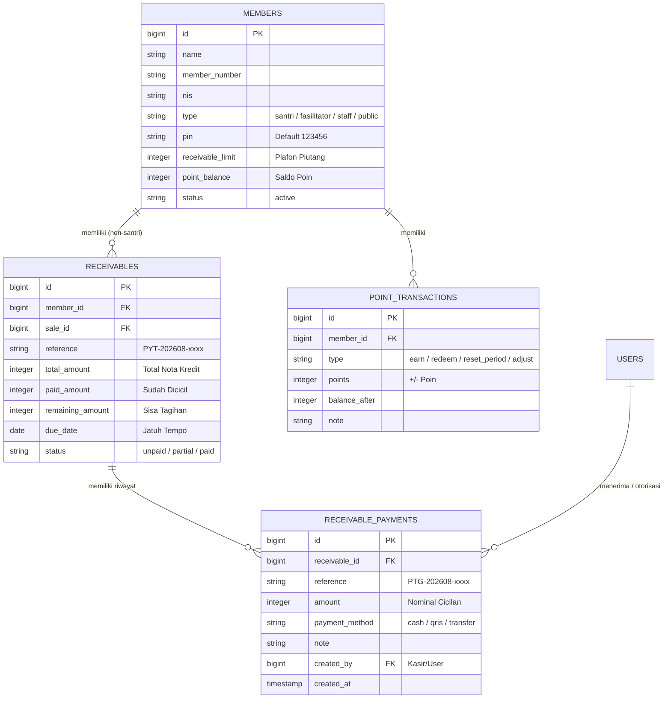

# 📐 MASTER BLUEPRINT & VISUAL MAPPING (PLAN.MD)

**Aplikasi:** S-Mart (Skillage Mart ERP & POS)  
**Fokus Pembaruan:**
1. 🔌 Perbaikan Akses Menu Integrasi (`/admin/integrations`)
2. 💳 Transformasi Modul Piutang: Tabel Per Anggota, Cicilan/Termin, Validasi PIN Kasir, Payment Gateway, & Slide-Over Sheet Kanan
3. 🚫 **Aturan Ketat Kredit:** Santri DILARANG Kredit/Hutang (Hanya Fasilitator, Staf, & Umum yang diizinkan)
4. 🔑 Default PIN Anggota `123456` & Sistem Reset Poin/PIN (Individu & Massal)

---

## 👥 1. AUDIT LEVEL & TIPE ANGGOTA (MEMBER ROLES)

Berdasarkan audit database dan seeder (`members` & `member_levels`):

| Kode Level / Tipe | Nama Level | Tipe Anggota (`type`) | Boleh Kredit/Hutang? | Keterangan |
| :--- | :--- | :--- | :---: | :--- |
| `SANTRI` | Santri | `santri` | ❌ **DILARANG** | Wajib Tunai, QRIS/Transfer, atau Saldo Deposit Wali |
| `SANTRI_BERPRESTASI` | Santri Berprestasi | `santri` | ❌ **DILARANG** | Diskon & Poin lebih tinggi, tetapi tetap tidak boleh kredit |
| `FASILITATOR` | Fasilitator (Guru/Ustadz) | `fasilitator` | ✅ **DIIZINKAN** | Berlaku limit piutang & validasi PIN |
| `STAF` | Staf / Karyawan | `staff` | ✅ **DIIZINKAN** | Berlaku limit piutang & validasi PIN |
| `UMUM` | Umum / Publik | `public` | ✅ **DIIZINKAN** | Berlaku jika diberikan limit piutang oleh manajemen |

### 🔒 Penegakan Validasi Kredit (Aturan Bisnis):
1. **Backend (`CreditHandler.php` & `PaymentService.php`):**
   - Pengecekan eksplisit: Jika `$member->type === 'santri'`, sistem otomatis menolak transaksi dengan pesan: *"Anggota santri tidak diizinkan menggunakan metode pembayaran Kredit/Tempo."*
2. **Frontend POS Kasir (`Pos/Index.tsx`):**
   - Tombol pilihan pembayaran `Kredit / Tempo` otomatis dinonaktifkan (*disabled*) dan diberi keterangan *"Santri tidak dapat kredit"* jika anggota yang dipilih bertipe santri.

---

## 🗺️ 2. PEMETAAN RELASI DATABASE (ERD)



---

## 🖥️ 3. VISUAL MAPPING UI — TABEL UTAMA PIUTANG PER ANGGOTA

Halaman utama `/admin/receivables` menampilkan ringkasan piutang **Per Anggota**:

### 📊 Kartu Ringkasan Umur Piutang (Aging):
| Total Piutang | Belum Jatuh Tempo | 1 - 30 Hari | 31 - 60 Hari | > 90 Hari (Macet) |
| :--- | :--- | :--- | :--- | :--- |
| **Rp 14.250.000** | **Rp 8.100.000** | **Rp 4.500.000** | **Rp 1.150.000** | **Rp 500.000** |

---

### 📋 Tabel Daftar Piutang Per Anggota:

| Anggota & Tipe | Plafon Limit | Total Tagihan | Sudah Dicicil | Sisa Piutang | Faktur | Jatuh Tempo | Status | Aksi |
| :--- | :---: | :---: | :---: | :---: | :---: | :---: | :---: | :---: |
| **Ust. Mansur, S.Pd**<br>`NIP: 19850110` (Fasilitator) | Rp 1.000.000 | Rp 450.000 | Rp 150.000 | **Rp 300.000** | 2 Nota | 25/08/2026 | 🟨 **Sebagian** | `[Kelola Piutang]` |
| **Siti Nurhaliza**<br>`NIP: 19880211` (Staf) | Rp 1.500.000 | Rp 800.000 | Rp 0 | **Rp 800.000** | 1 Nota | 15/08/2026 | 🟥 **Lewat JT (6h)** | `[Kelola Piutang]` |
| **Budi Santoso**<br>`No: UMM-0012` (Umum) | Rp 500.000 | Rp 120.000 | Rp 120.000 | **Rp 0** | 0 Nota | — | 🟩 **Lunas** | `[Kelola Piutang]` |

---

## 🗂️ 4. VISUAL MAPPING UI — SLIDE-OVER SHEET DARI KANAN (DRAWER)

Saat tombol **`[Kelola Piutang]`** diklik, panel samping kanan (*Drawer/Sheet*) terbuka:

```
┌────────────────────────────────────────────────────────────┐
│ 👤 KELOLA PIUTANG: Ust. Mansur, S.Pd                       │
│ NIP: 19850110 · Fasilitator / Guru                         │
├────────────────────────────────────────────────────────────┤
│ 📊 Ringkasan Keuangan:                                     │
│ • Total Plafon Limit   : Rp 1.000.000                      │
│ • Sisa Plafon Tersedia : Rp   700.000                      │
│ • Total Sisa Piutang   : Rp   300.000 (2 Faktur Terbuka)   │
│ • Jatuh Tempo Terdekat : 25/08/2026 (4 hari lagi)          │
└────────────────────────────────────────────────────────────┘
```

### 💳 Formulir Pembayaran Cicilan / Pelunasan:

```
┌────────────────────────────────────────────────────────────┐
│ 💳 Form Bayar Cicilan:                                     │
├────────────────────────────────────────────────────────────┤
│ 1. Alokasi Pembayaran:                                     │
│    (•) Faktur Tertua (FIFO)       ( ) Pilih Faktur Khusus  │
│                                                            │
│ 2. Nominal Pembayaran:                                     │
│    [ Rp 150.000                       ]                    │
│    [Tombol: Bayar Sebagian]  [Tombol: Lunasi Penuh]        │
│                                                            │
│ 3. Metode Pembayaran:                                      │
│    (•) 💵 Tunai di Kasir                                   │
│    ( ) 📲 QRIS / Transfer Gateway (Midtrans)               │
│                                                            │
│ ── [Jika Pilih Tunai] ───────────────────────────────────  │
│ 🔑 PIN Kasir Bertugas : [ •••••• ] (Wajib 6 digit PIN)     │
│ Akun Kas Penerima     : [ Kasir Toko Utama ▼ ]             │
│                                                            │
│ ── [Jika Pilih QRIS/Transfer] ───────────────────────────  │
│ ℹ️ Popup Snap QRIS / Bank Transfer otomatis tampil         │
│                                                            │
│ Catatan (Opsional)    : [ Pembayaran titipan gaji... ]     │
│                                                            │
│ [ 💾 SIMPAN & CETAK KUITANSI CICILAN ]                     │
└────────────────────────────────────────────────────────────┘
```

---

### 📑 Tab Rincian di dalam Slide-Over:

#### Tab 1: Daftar Faktur / Nota Kredit Belum Lunas
| No. Nota / Referensi | Tgl Belanja | Jatuh Tempo | Total Nota | Sisa Hutang | Status |
| :--- | :---: | :---: | :---: | :---: | :---: |
| `POS-202608-0012`<br>`(PYT-202608-0004)` | 10/08/2026 | 25/08/2026 | Rp 200.000 | **Rp 100.000** | 🟨 Sebagian |
| `POS-202608-0089`<br>`(PYT-202608-0021)` | 18/08/2026 | 01/09/2026 | Rp 200.000 | **Rp 200.000** | ⬜ Belum Bayar |

---

#### Tab 2: Riwayat Cicilan & Kuitansi (Termin)
| No. Kuitansi | Tgl & Jam Bayar | Metode | Nominal | Kasir / Petugas | Aksi |
| :--- | :---: | :---: | :---: | :---: | :---: |
| `PTG-202608-0015` | 15/08 14:20 | 💵 Tunai | **Rp 100.000** | Kasir Budi (PIN Valid) | `[🖨️ Struk]` |
| `PTG-202608-0002` | 12/08 09:10 | 📲 QRIS Midtrans | **Rp 50.000** | Auto Gateway Webhook | `[🖨️ Struk]` |

---

## 🖨️ 5. STRUK KUITANSI TERMAL CICILAN PIUTANG (58mm/80mm)

```
+--------------------------------+
|         SKILLAGE MART          |
|    SMK Skill Village Islamic   |
|   Jonggol, Kab. Bogor - Jabar  |
+--------------------------------+
| BUKTI PEMBAYARAN PIUTANG       |
| No. Kuitansi : PTG-202608-0015 |
| Tanggal      : 21/08/2026 14:35|
| Kasir        : Budi Santoso    |
+--------------------------------+
| Anggota : Ust. Mansur, S.Pd    |
| NIP     : 19850110 (Fasilitator|
+--------------------------------+
| RINCIAN ALOKASI:               |
| Faktur: POS-202608-0012        |
| - Total Tagihan   : Rp 200.000 |
| - Pokok Cicilan   : Rp 100.000 |
| - Sisa Nota Ini   : Rp 100.000 |
+--------------------------------+
| TOTAL DIBAYAR   : Rp 100.000   |
| Metode          : TUNAI        |
| Otorisasi Kasir : VALID (PIN)  |
+--------------------------------+
| SISA TOTAL HUTANG ANGGOTA:     |
| Rp 200.000                     |
| Plafon Tersedia : Rp 800.000   |
+--------------------------------+
|      Terima kasih atas         |
|      pembayaran tepat waktu    |
+--------------------------------+
```

---

## 🔐 6. MODAL FITUR RESET POIN & PIN DEFAULT 123456

### A. Reset PIN & Penyesuaian Poin di Menu Anggota (`/admin/members`)

```
┌────────────────────────────────────────────────────────────┐
│ 🔑 Reset PIN Anggota: Ust. Mansur, S.Pd                    │
├────────────────────────────────────────────────────────────┤
│ • PIN anggota akan diatur ulang ke default: 123456         │
│ • Status kunci (lockout) & percobaan salah dikosongkan.    │
│                                                            │
│                  [ Batal ]   [ Ya, Reset ke 123456 ]       │
└────────────────────────────────────────────────────────────┘
```

```
┌────────────────────────────────────────────────────────────┐
│ ⭐ Penyesuaian Saldo Poin: Ust. Mansur, S.Pd               │
├────────────────────────────────────────────────────────────┤
│ Saldo Poin Saat Ini : 450 Poin                             │
│                                                            │
│ Aksi Penyesuaian    : (•) Reset Menjadi 0 Poin             │
│                       ( ) Tambah / Kurangi Poin Manual     │
│                                                            │
│ Alasan Audit        : [ Tutup Buku Semester Genap...     ] │
│                                                            │
│                  [ Batal ]   [ Simpan Penyesuaian ]        │
└────────────────────────────────────────────────────────────┘
```

---

### B. Modal Reset Poin Massal di Menu Poin Reward (`/admin/points`)

```
┌────────────────────────────────────────────────────────────┐
│ ⚠️ RESET SALDO POIN MASSAL (SEMUA ANGGOTA)                 │
├────────────────────────────────────────────────────────────┤
│ PERINGATAN:                                                │
│ Seluruh saldo poin anggota aktif akan direset menjadi 0.   │
│ Riwayat akan tercatat sebagai transaksi 'reset_period'.    │
│                                                            │
│ Keterangan Periode :                                       │
│ [ Pembersihan Poin Akhir Tahun Ajaran 2025/2026          ] │
│                                                            │
│ Ketik "RESET SEMUA POIN" untuk konfirmasi keamanan:        │
│ [ RESET SEMUA POIN                                       ] │
│                                                            │
│                  [ Batal ]   [ 🔴 Eksekusi Reset Massal ]  │
└────────────────────────────────────────────────────────────┘
```

---

## 🛠️ 7. FILE YANG AKAN DIMODIFIKASI

| No | Modul | File Terkait | Rincian Perubahan |
|:---|:---|:---|:---|
| 1 | **Integrasi** | `config/navigation.php`<br>`routes/admin.php` | Ubah permission dari `system.reset` ke `['setting.view', 'system.reset']`. |
| 2 | **Validasi Non-Santri Kredit** | `app/Services/PaymentHandlers/CreditHandler.php`<br>`app/Services/PaymentService.php`<br>`resources/js/Pages/Admin/Pos/Index.tsx` | Blokir metode kredit jika `member->type === 'santri'`. Hanya izinkan `fasilitator`, `staff`, dan `public`. |
| 3 | **Default PIN 123456** | `app/Services/MemberService.php`<br>`app/Services/MemberPinService.php` | Set otomatis PIN `123456` untuk anggota baru & whitelist PIN default. Buat command/migrasi sinkronisasi anggota lama. |
| 4 | **Reset Poin & PIN** | `app/Http/Controllers/Admin/MemberController.php`<br>`app/Http/Controllers/Admin/PointController.php`<br>`app/Services/PointService.php` | Tambah endpoint reset PIN ke 123456, penyesuaian poin individu, dan reset poin massal semester/tahunan. |
| 5 | **Backend Piutang** | `app/Http/Controllers/Admin/ReceivableController.php`<br>`app/Services/ReceivableService.php`<br>`app/Http/Requests/Admin/PayReceivableRequest.php` | Agregasi data per anggota, logika cicilan FIFO / per faktur, validasi PIN Kasir (tunai), dan payload Snap token Midtrans (QRIS/Transfer). |
| 6 | **Frontend Piutang** | `resources/js/Pages/Admin/Receivables/Index.tsx`<br>`resources/js/Components/ui/sheet.tsx` | Tabel berbasis anggota, Slide-over sheet kanan dengan Tab Faktur, Tab Termin, dan formulir cicilan interaktif. |
| 7 | **Struk Termal** | `resources/views/pdf/receivable_payment.blade.php`<br>`app/Http/Controllers/Admin/ReceivableController.php` | Template cetak PDF kuitansi cicilan termal 58mm/80mm. |

---

## 🎯 8. CHECKLIST EKSEKUSI

- [ ] **Fase 1:** Perbaiki navigasi & route permission menu Integrasi.
- [ ] **Fase 2:** Terapkan aturan blokir kredit untuk Santri (`CreditHandler`, `PaymentService`, & POS Kasir).
- [ ] **Fase 3:** Implementasi PIN default 123456, sinkronisasi DB, dan fitur Reset Poin/PIN (individu & massal).
- [ ] **Fase 4:** Backend alur cicilan piutang (agregasi anggota, FIFO, verifikasi PIN Kasir, payment gateway).
- [ ] **Fase 5:** Frontend UI tabel piutang per anggota & Slide-Over Sheet kanan dengan Tabs & Form Cicilan.
- [ ] **Fase 6:** Template struk termal kuitansi cicilan & verifikasi pengujian akhir (`tsc`, `php -l`).
