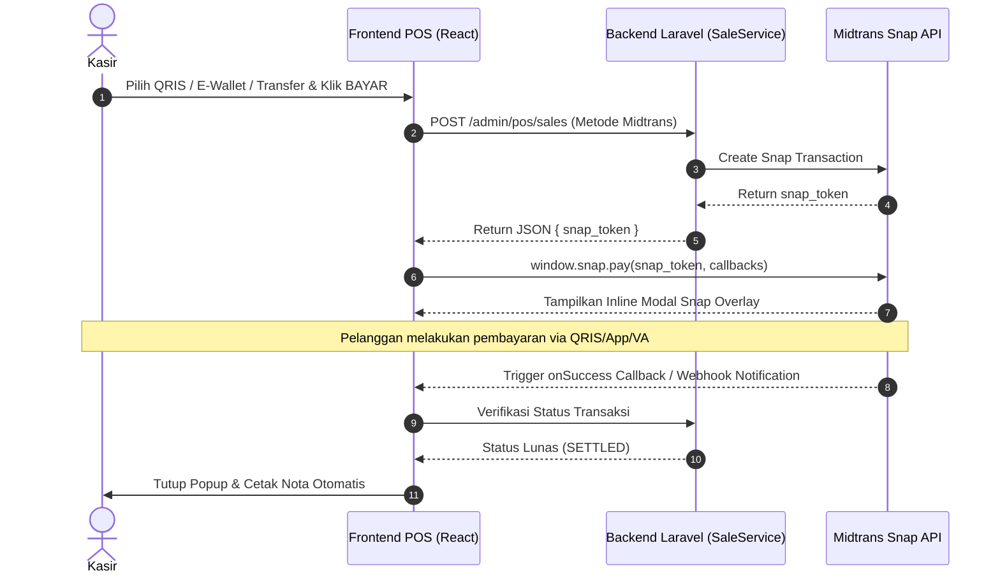

# 📑 Rencana Arsitektur & Alur 10 Metode Pembayaran POS

## 📌 1. Ringkasan Eksekutif & Tujuan

Dokumen ini berisi rencana arsitektur dan alur kerja untuk **10 metode pembayaran kasir POS** di sistem Skillage Mart. 

**Tujuan Utama:**
1. **Midtrans Inline Snap Modal:** Transaksi online (QRIS, E-Wallet, Transfer) menggunakan modal popup Snap terintegrasi langsung di layar kasir POS tanpa pengalihan (*redirect*) atau pembukaan *tab* baru.
2. **Alur & Relasi 7 Metode Internal/Offline:** Setiap metode pembayaran internal memiliki dialog modal input khusus, validasi bisnis di kasir, dan relasi atomik ke modul database terkait (Member, Promosi, Poin Loyalty, Piutang, dan Payroll).

---

## ⚡ 2. Midtrans Online Snap Flow (QRIS, E-Wallet, Transfer)



### Key Implementation Details:
- **Snap JS Script:** Dimuat secara kondisional di `PosLayout` (`https://app.sandbox.midtrans.com/snap/snap.js` atau production).
- **No Redirect:** Menggunakan Callback Object `window.snap.pay(token, { onSuccess, onPending, onError, onClose })`.
- **Auto-Receipt:** Setelah callback `onSuccess` diterima atau status terkonfirmasi, kasir langsung diarahkan ke dialog cetak nota.

---

## 🏬 3. Detail Alur & Relasi 10 Metode Pembayaran

### 💵 1. Tunai (CASH)
- **Modal POS:** Input Uang Diterima + Tombol Pintas Nominal (10k, 20k, 50k, 100k, Uang Pas).
- **Validasi Kasir:** Nominal diterima $\ge$ Total Belanja.
- **Perhitungan:** Hitung Kembalian = Uang Diterima − Total Belanja.
- **Relasi Database:** 
  - `cashier_sessions`: Menambah saldo kas fisik di laci kasir.
  - `sales_payments`: Mencatat pembayaran tipe `cash`.

### 🏦 2. Saldo Deposit (DEPOSIT)
- **Modal POS:** Dialog Konfirmasi Deposit Member + Field Input PIN Member (4-6 digit).
- **Validasi Kasir:** Member harus dipilih & Saldo Deposit Member (`balance_cache`) $\ge$ Total Belanja. Validasi PIN benar.
- **Relasi Database:**
  - `members`: Mendeduksi `balance_cache`.
  - `deposit_mutations`: Mencatat mutasi keluar tipe `debit` transaksi belanja POS.

### 💳 3. Kartu Debit / EDC (CARD)
- **Modal POS:** Input Nomor Referensi / Struk Mesin EDC + Dropdown Nama Bank Mesin EDC (BCA, Mandiri, BRI, dll).
- **Validasi Kasir:** Nomor Trace/Ref EDC wajib diisi oleh kasir sebagai nomor bukti fisik.
- **Relasi Database:**
  - `sales_payments`: Mencatat `reference_number` dan bank EDC untuk rekonsiliasi kasir akhir shift.

### 🎟️ 4. Voucher Belanja (VOUCHER)
- **Modal POS:** Input / Scan Kode Barcode Voucher Toko.
- **Validasi Kasir:** 
  - Status Voucher aktif (`is_used = false`).
  - Tanggal belum kadaluarsa (`valid_until >= now()`).
  - Total belanja memenuhi syarat minimum pembelian (`min_purchase`).
- **Relasi Database:**
  - `vouchers`: Mengubah status `is_used = true` & `used_at = now()`.
  - `voucher_usages`: Mencatat riwayat penggunaan voucher pada nota transaksi.

### ⭐ 5. Poin Loyalty (POINT)
- **Modal POS:** Dialog Input Jumlah Poin yang Ingin Ditukarkan + Informational Rate (Contoh: 100 Poin = Rp 1.000).
- **Validasi Kasir:** Member terpilih & Jumlah Poin Member $\ge$ Poin yang Ditukarkan.
- **Relasi Database:**
  - `members`: Mendeduksi total poin member.
  - `point_mutations`: Mencatat ledger mutasi poin keluar (`redeem_pos`).

### 🕐 6. Kredit / Tempo (CREDIT)
- **Modal POS:** Dialog Pemilihan Tanggal Jatuh Tempo (*Due Date Picker*) + Catatan Penagihan.
- **Validasi Kasir:** 
  - Member terverifikasi memiliki akses utang/kredit.
  - Total Piutang Aktif + Belanja Baru $\le$ Limit Kredit Member (`credit_limit`).
- **Relasi Database:**
  - `receivables`: Membuat record piutang baru (status: `unpaid`, `due_date`).
  - `receivable_ledger`: Mencatat histori penagihan.

### 📋 7. Potong Gaji (PAYROLL)
- **Modal POS:** Dialog Input NIK / NIP Pegawai + Verifikasi Sandi/PIN Pegawai.
- **Validasi Kasir:** Pegawai terdaftar aktif & akumulasi potong gaji bulan berjalan belum melebihi plafon maksimum potong gaji.
- **Relasi Database:**
  - `employee_payroll_deductions`: Mencatat pemotongan gaji bulan berjalan untuk diproses oleh modul HRD/Payroll di akhir bulan.

---

## 🔄 4. Pemetaan Relasi Database Inter-Modul

```
[POS Sale] ───► [sales_payments] ───► [payment_methods]
    │
    ├─────────► [members] ──────────► [deposit_mutations] (Deposit)
    │                         └─────► [point_mutations]   (Poin)
    │
    ├─────────► [vouchers] ─────────► [voucher_usages]   (Voucher)
    │
    ├─────────► [receivables] ──────► [receivable_ledger] (Kredit/Tempo)
    │
    └─────────► [employee_payroll_deductions]             (Potong Gaji)
```

---

## 🚀 5. Tahapan Eksekusi (Implementation Roadmap)

### **Fase 1: Midtrans Inline Snap Overlay**
- [ ] Tambahkan helper `loadSnapScript` di `PosLayout`.
- [ ] Update handler submit POS untuk memicu `window.snap.pay()` saat memilih metode Midtrans.

### **Fase 2: Komponen Dialog Modal Input Kasir POS**
- [ ] Buat dialog modal PIN Deposit (`DepositModal.tsx`).
- [ ] Buat dialog modal Input Trace EDC (`EdcModal.tsx`).
- [ ] Buat dialog modal Voucher Code (`VoucherModal.tsx`).
- [ ] Buat dialog modal Tukar Poin (`PointsModal.tsx`).
- [ ] Buat dialog modal Kredit/Tempo (`CreditModal.tsx`).
- [ ] Buat dialog modal Potong Gaji (`PayrollModal.tsx`).

### **Fase 3: Validasi & Transaksi Backend Atomik**
- [ ] Tambahkan validasi atomik di `SaleService.php` (`DB::transaction`) untuk memastikan pemotongan saldo/poin/voucher konsisten tanpa *race condition*.
- [ ] Uji coba transaksi kasir untuk seluruh 10 metode pembayaran.
